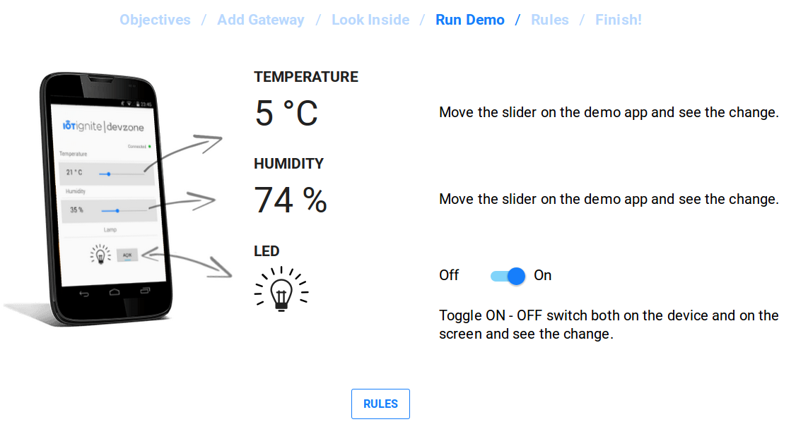
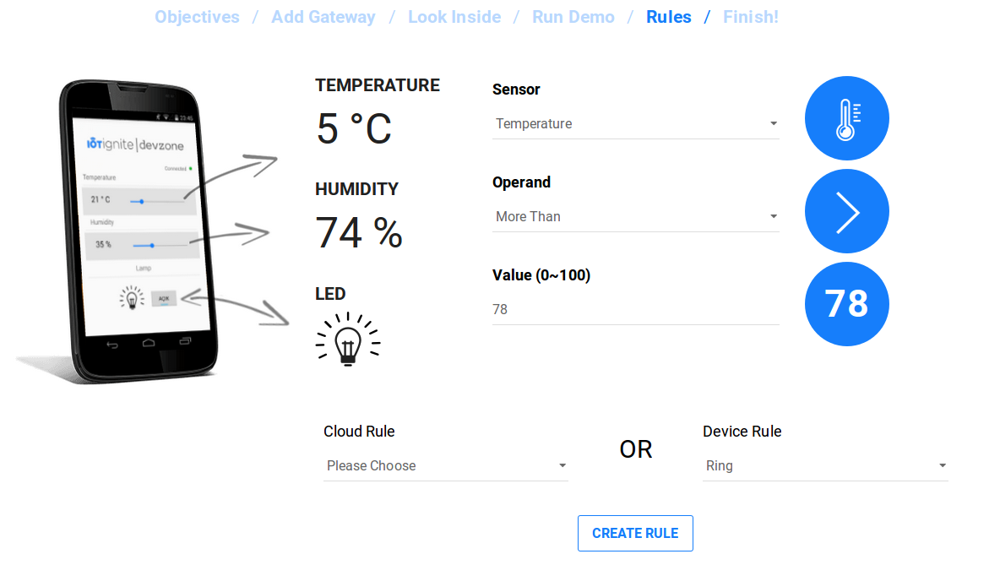

# IoT-Ignite Virtual Demo Application
Here you can experience basics of an IoT project with IoT-Ignite value-adds. You can observe the sensor values and define rules at IoT-Ignite Devzone Panel.

Note that, you have to install IoT-Ignite Agent to your Android device and register that device to IoT-Ignite. Please visit demo page for the instructions: [devzone.iot-ignite.com/dpanel/demo](https://devzone.iot-ignite.com/dpanel/demo)

In the demo code, you can see how to build a connection with IoT-Ignite Agent, how to create node and sensors and how to send sensor data to IoT-Ignite Cloud. Additionally, you can see how to receive sensor data configurations and actuator data and more.

Github Page: [github.com/IoT-Ignite/android-example-IoTIgniteDemoApp](https://github.com/IoT-Ignite/android-example-IoTIgniteDemoApp)

Full Documentation: [iot-ignite.github.io/android-example-IoTIgniteDemoApp/](https://iot-ignite.github.io/android-example-IoTIgniteDemoApp/)

IoT-Ignite Documents: [devzone.iot-ignite.com/documents/](https://devzone.iot-ignite.com/documents/)

IoT-Ignite Device SDK Reference: [devzone.iot-ignite.com/device-api/iot-ignite/reference/](https://devzone.iot-ignite.com/device-api/iot-ignite/reference/)

For full information about IoT-Ignite, please visit [iot-ignite.com](http://www.iot-ignite.com).
